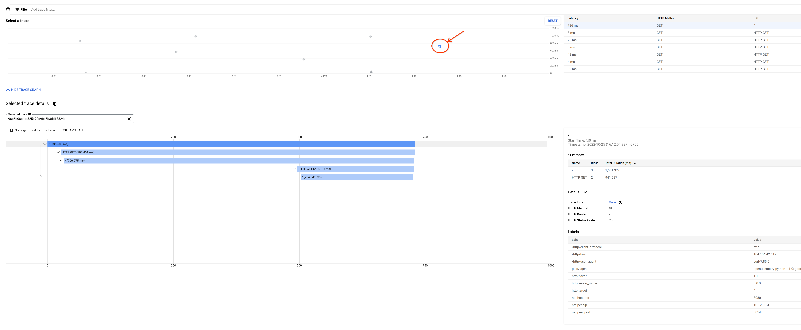

# Cloud-trace-demo-app-opentelemetry


### [View all Roadmaps](https://github.com/nholuongut/all-roadmaps) &nbsp;&middot;&nbsp; [Best Practices](https://github.com/nholuongut/all-roadmaps/blob/main/public/best-practices/) &nbsp;&middot;&nbsp; [Questions](https://www.linkedin.com/in/nholuong/)
<br/>
Open this demo app in [Google Cloud Shell](https://cloud.google.com/shell/docs/). This includes necessary tools.

## Demo Requirements
If you are using Cloud Shell, skip to the next section.

1. Install gcloud <https://cloud.google.com/sdk/install>
2. Install kubectl <https://kubernetes.io/docs/tasks/tools/install-kubectl/>
3. Install docker <https://docs.docker.com/install/>

## Deploy and run the demo application

1. Enable Google Cloud and set up region and zone.

   ```bash
   gcloud init
   ```

1. Enable the GKE API:

   ```bash
   gcloud services enable container.googleapis.com
   ```

1. Setup GCP project to `YOUR_PROJECT_ID`. Replace `YOUR_PROJECT_ID` with your GCP project id.

   ```bash
   gcloud config set project YOUR_PROJECT_ID
   ```

1. Setup the location of GKE cluster and create a new cluster named
`cloud-trace-demo`.
The example below sets the cluster's location to the "us-central1-c" zone.
You can replace the zone with one which you like. See [zones][] for the full
list.

   ```bash
   ZONE=us-central1-c
   gcloud container clusters create cloud-trace-demo \
       --zone $ZONE
   ```

1. Update GKE cluster credentials and verify the access to the cluster:

   ```bash
   gcloud container clusters get-credentials cloud-trace-demo --zone $ZONE
   kubectl get nodes
   ```

   The output is similar to the following:

   ```bash
   NAME                                              STATUS   ROLES    AGE     VERSION
   gke-cloud-trace-demo-default-pool-43f3fe97-dnk1   Ready    <none>   5m      v1.23.8-gke.1900
   gke-cloud-trace-demo-default-pool-43f3fe97-j2b8   Ready    <none>   5m      v1.23.8-gke.1900
   gke-cloud-trace-demo-default-pool-43f3fe97-znvv   Ready    <none>   5m      v1.23.8-gke.1900
   ```

1. Download the demo application:

   ```bash
   git clone https://github.com/nholuongut/python-docs-samples
   cd python-docs-samples/trace/cloud-trace-demo-app-opentelemetry/
   ```

1. Setup the application:

   ```bash
   ./setup.sh
   ```

   The setup deployes 3 services of the demo application using a pre-built
   image. If you like, you can build your own container image using
   [`app/Dockerfile`][dockerfile].

1. Track the status of the deployment:

   ```bash
   kubectl get deployments
   ```

   The output is similar to the following:

   ```bash
   NAME                 READY   UP-TO-DATE   AVAILABLE   AGE
   cloud-trace-demo-a   1/1     1            1           3m
   cloud-trace-demo-b   1/1     1            1           3m
   cloud-trace-demo-c   1/1     1            1           3m
   ```

1. Send a curl request to the cloud-trace-demo-a:

   ```bash
   curl $(kubectl get svc -o=jsonpath='{.items[?(@.metadata.name=="cloud-trace-demo-a")].status.loadBalancer.ingress[0].ip}')
   ```

   The output is similar to the following:

   ```bash
   Hello, I am service A
   And I am service B
   Hello, I am service C
   ```

1. Visit [Trace List](https://console.cloud.google.com/traces/list) to check traces generated.
    Click on any trace in the graph to see the Waterfall View.

    

1. To clean up the provisioned resources:

   ```bash
   gcloud container clusters delete cloud-trace-demo --zone $ZONE
   ```

[zones]: https://cloud.google.com/compute/docs/regions-zones#zones_and_clusters
[dockerfile]: https://github.com/GoogleCloudPlatform/python-docs-samples/blob/main/trace/cloud-trace-demo-app-opentelemetry/app/Dockerfile


# 🚀 I'm are always open to your feedback.  Please contact as bellow information:
### [Contact Me]
* [Name: Nho Luong]
* [Skype](luongutnho_skype)
* [Github](https://github.com/nholuongut/)
* [Linkedin](https://www.linkedin.com/in/nholuong/)
* [Email Address](luongutnho@hotmail.com)
* [PayPal.me](https://www.paypal.com/paypalme/nholuongut)


[](https://ko-fi.com/nholuong)

# License
* Nho Luong (c). All Rights Reserved.🌟